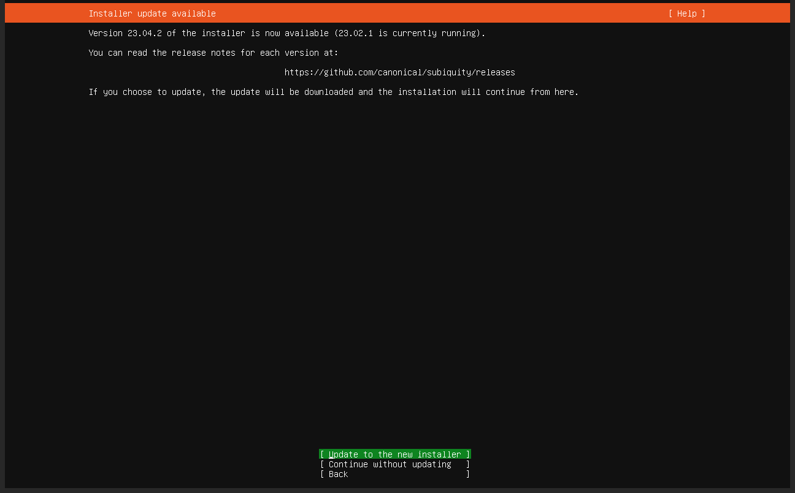
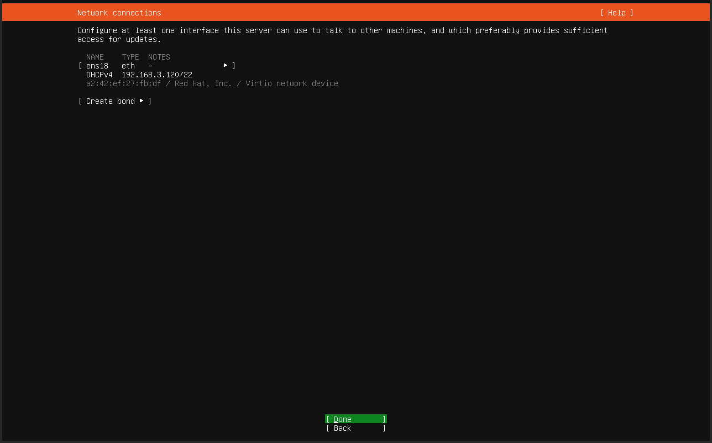
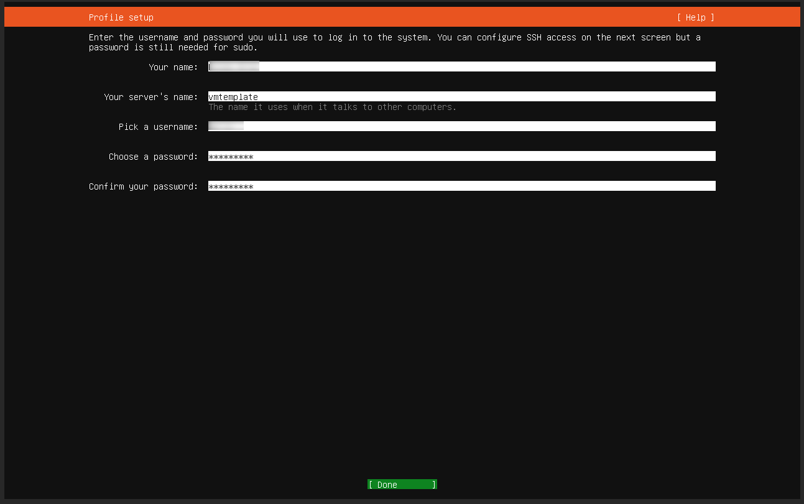

# Ubuntu

One of the most popular operating systems at the time of publishing is **Ubuntu Server**, however the members of the Infrastructure Builders' Programme are encouraged to try other options and create additional instructions for this wiki.

## Download and Installation

The process of downloading the Ubuntu Server installer and/or its ISO image will likely depend on your hypervisor technology (e.g. EXSi, [Proxmox](/docs/6-members/3-hypervisors/1-proxmox.md), etc).

Once the Virtual Machine is started up and launches the installation procedure, you will see the following screen:











## First Access

By now you should have selected your own access credentials, either in the form of a plain `root` user, or an user with extra permissions (`sudo` user), etc. in any cases, let's use the ***username*** convention.

Additionally, you should already know the IP address(es) assigned to your VM, these could be in the form of an IPv4 address (e.g. 123.16.1.1) and/or the newer IPv6 (e.g. 2001:db8::8a2e:37:334), in any case, let's use the ***ipaddress*** convention.

Disregarding where in the world is your VM, we will refer to it as a "Remote Server" just to differentiate it from your local management machine (e.g. your laptop), you see, the big difference will be that your local machine has a keyboard and a screen attached to it, while the remote server, well, doesn't.

From any terminal in your local machine (e.g. DOS, PowerShell, etc.) access your server with the following command (be prepared to enter the password corresponding to the relevant user):

```shell
ssh username@ipaddress
```

and you should get a response of the terminal similar to

```text
Ubuntu 22.04.1 LTS ipaddress tty1

ipaddress login:
```

Once you enter your ***username*** and ***password***, you will be executing shell commands as if you actually were in the Remote Server.

Now it is highly recommendable to update all the software packages which were provisioned by the hosting, these could be now obsolete and/or carry additional security risks, then reboot the machine to ensure the changes are enacted:

```shell
sudo apt update
sudo apt full-upgrade
sudo apt autoremove
sudo reboot
```

:::note

you may find that entering separately the commands above (one line at a time) is easier to understand than to concatenate all of them with the `&&` operator.

:::

:::note

In the commands above, the `sudo` part is not needed if you are in fact using the `root` user.

:::

You will be disconnected from the remote server and may need to wait for a short moment while it reboots, if you try to connect too soon you will have either no response or an error returned from the below command:

```shell
ssh username@ipaddress
```

## Create Users

> Once you are logged in the remote server

### Secure the `root` or default user

Whether you were given a root or a default sudo user credentials, the most important task to complete as soon as you have access to your remote machine is to change all the passwords of these users, especially for the root user, with very secure and private ones.

Change first the password of the user that you are using to connect to the server (either root or a default one given to you by the hosting provider):

```shell
passwd
```

In case you were using a default user, please remember to switch users to the root one, change its password and return to the default user with the below commands:

```shell
sudo su -
passwd
logout
```

### Create your custom user(s)

Using a root user directly is not recommended in most cases, particularly for systems which will be accessed by several users, or when the applications are compartmentalised to use several application-level users.

Create a customised user (to replace the default credentials by VPS provider):

```shell
sudo adduser yourusername
```

You can check that the user was created by inspecting the relevant file:

```shell
tail /etc/passwd
```

the output should look similar to:

```text
landscape:x:111:116::/var/lib/landscape:/usr/sbin/nologin
ubuntu:x:1000:1000:Ubuntu:/home/ubuntu:/bin/bash
lxd:x:999:100::/var/snap/lxd/common/lxd:/bin/false
usbmux:x:112:46:usbmux daemon,,,:/var/lib/usbmux:/usr/sbin/nologin
yourusername:x:1001:1001:,,,:/home/yourusername:/bin/bash
```

Add the new user to the sudo group, this way this user will be able to execute command that otherwise would be reserved for the root user only.

```shell
sudo usermod -aG sudo yourusername
```

You can check the updated associations to the relevant groups, including sudo, with:

```shell
groups yourusername
```

The output should be similar to:

```text
yourusername: yourusername sudo
```

Now you can create the rest of your custom users, or terminate your session with the default credentials:

```shell
exit
```

and login with any of the new ones:

```shell
ssh yourusername@ipaddress
```

## Harden Security

> Finally, the machine will appreciate some protections against security risks and external threats.

Most of the security recommendations of this chapter have been compiled from sources pertaining to the cryptographic security fields, like these ones:

1. https://stribika.github.io/2015/01/04/secure-secure-shell.html
2. https://wiki.polkadot.network/docs/maintain-guides-secure-validator
3. https://password.jcu.edu/public/passphrase.php
4. https://www.fbi.gov/contact-us/field-offices/phoenix/news/press-releases/fbi-tech-tuesday-strong-passphrases-and-account-protection
5. https://www.ssh.com/academy/ssh/public-key-authentication

### Secure SSH connection

#### Passwords, Passphrases and Keypairs

You are surely familiar with the concept of **passwords**, which are a combination of special characters, letters, and numbers with variable lengths. Most are around 10 characters, like, for example: "Passw0rd1!"

A **passphrase** is basically a longer password, usually at least 14 characters in length, or a combination of several words with spaces between them, better if the words are completely random and make no sense as a phrase. A passphrase can also contain symbols, and it does not need to be grammatically correct. The passphrase meaning should not be easy to guess or be a typical or common phrase, like a saying or song's lyrics. using a random phrase makes a passphrase stronger. An example of a passphrase can be “Daughter seeking pine4ppl3! bookstore philanthropy” A passphrase should be easy to remember but hard for hackers to crack and guess.

A **keypair**, on the other hand is a set of two related keys used in asymmetrical cryptography to share messages between peers using their destination **public** keys and deciphering at destination using the relevant **private** key. The public key is usually shorter than the private key, and there is an ongoing analogy comparing the public key with "addresses" or "usernames" and private keys to "passwords". Finally, public keys can be obtained from the private key, but the opposite is not possible.

### Deploy SSH keypair

To best protect the way you establish SSH connections to your remote server, let's create a SSH key pair directly in your local terminal (for this, please have prepared a good passphrase with at least 128 bits of entropy, and store it securely, preferably in a offline medium). Note: you may prefer creating ed25519 keys instead of default RSA ones, like that:

```shell
ssh-keygen -t ed25519
```

After providing a passphrase, two files will be created in a hidden folder of your home directory:

- /home/username/.ssh/id_ed25519 <- Caution!, this is your **Private Key**!!
- /home/username/.ssh/id_ed25519.pub <- this is the **Public Key** (you can share this file)

The next step is to copy the public key to the correct directory of remote server, and that is done by means of the following command (this action will prompt for the current password of the user in the remote server):

```shell
ssh-copy-id -i /home/username/.ssh/id_ed25519.pub username@yourhost.yourdomain.tld
```

From now on, every time to start a SSH connection to your server, the authentication mechanism will determine the existence of a keypair and you will be now asked for the passphrase to decode the keys (and not the user password) for establishing this connection.

### Configure Remote SSH Daemon

In this step, you will edit the `sshd_config` file to 1) disable the transmission of passwords, 2) specify the cryptographic algorithms to use 3) limit the incoming logins, 4) limit the time needed to login and 5) show a warning message (optional):

```shell
sudo cp /etc/ssh/sshd_config /etc/ssh/sshd_config.bak
sudo nano /etc/ssh/sshd_config
```

Go through the file and enable and update the following lines according to your requirements:

```conf
(...)
Port yourcustomport
(...)
KexAlgorithms curve25519-sha256
Protocol 2
(...)
HostKey /etc/ssh/ssh_host_ed25519_key
(...)
Ciphers chacha20-poly1305@openssh.com,aes256-gcm@openssh.com,aes128-gcm@openssh.com,aes256-ctr,aes192-ctr,aes128-ctr
MACs hmac-sha2-512-etm@openssh.com,hmac-sha2-256-etm@openssh.com,umac-128-etm@openssh.com,hmac-sha2-512,hmac-sha2-256,umac-128@openssh.com
(...)
LoginGraceTime 30
PermitRootLogin no
AllowUsers yourusername
DenyUsers defaultusername
StrictModes yes
(...)
PubkeyAuthentication yes
(...)
PasswordAuthentication no
PermitEmptyPasswords no
(...)
ChallengeResponseAuthentication no
(...)
UsePAM yes
(...)
X11Forwarding no
MaxStartups 2:30:5
Banner /etc/issue.net
```

:::note

As you are using Pluggable Authentication Modules (PAM), you may want to study this particular service and make additional security checks to the default behaviour, a good starting point may be this one:

- [The Linux Documentation Project: Securing User Authentication](https://tldp.org/HOWTO/User-Authentication-HOWTO/x263.html)

:::

Now you can edit the default banner that is presented when the server requires the password/passphrases:

```shell
sudo nano /etc/issue.net
```

A message like the following one will not deter any convinced attacker, but it will let them know that you may be watching!

```text
***************************************************************************
                            NOTICE TO USERS

This computer system is the private property of its owner, whether
individual, corporate or government.  It is for authorized use only.
Users (authorized or unauthorized) have no explicit or implicit
expectation of privacy.

Any or all uses of this system and all files on this system may be
intercepted, monitored, recorded, copied, audited, inspected, and
disclosed to your employer, to authorized site, government, and law
enforcement personnel, as well as authorized officials of government
agencies, both domestic and foreign.

By using this system, the user consents to such interception, monitoring,
recording, copying, auditing, inspection, and disclosure at the
discretion of such personnel or officials.  Unauthorized or improper use
of this system may result in civil and criminal penalties and
administrative or disciplinary action, as appropriate. By continuing to
use this system you indicate your awareness of and consent to these terms
and conditions of use. LOG OFF IMMEDIATELY if you do not agree to the
conditions stated in this warning.

****************************************************************************
```

You may also want to customise the Message-of-the-Day (MOTD) to greet users after authenticating correctly in your server:

```shell
sudo nano /etc/motd
```

and insert your custom message here

```text
 █████╗  ██████╗███╗   ███╗███████╗    ██╗███╗   ██╗ ██████╗   
██╔══██╗██╔════╝████╗ ████║██╔════╝    ██║████╗  ██║██╔════╝   
███████║██║     ██╔████╔██║█████╗      ██║██╔██╗ ██║██║        
██╔══██║██║     ██║╚██╔╝██║██╔══╝      ██║██║╚██╗██║██║        
██║  ██║╚██████╗██║ ╚═╝ ██║███████╗    ██║██║ ╚████║╚██████╗██╗
╚═╝  ╚═╝ ╚═════╝╚═╝     ╚═╝╚══════╝    ╚═╝╚═╝  ╚═══╝ ╚═════╝╚═╝
Welcome to Acme Incorporated, beep beep!                    
```

finally, if you want that the MOTD includes information about the hardware, check that you have installed the following package:

```shell
sudo apt install landscape-common
```

now you must restart the SSH service:

```shell
sudo systemctl restart ssh
```

:::note
As you changed critical settings for the SSH daemon, it is strongly advisable that, after restarting the service, you open a second terminal and try to connect to your server using the new configuration (pay special attention to new ports and allowed usernames, etc.) only when you have succeeded establishing connection in this second terminal, you can proceed with the following commands.
:::

```shell
sudo reboot
```

Now remember to use the following command structure to connect to your server with this customised SSH daemon configuration:

```shell
ssh -p yourcustomport yourusername@yourhost.yourdomain.tld
```

### Using SSH Agent

Another alternative to providing the passphrase on every connection start is to use “agents” to facilitate the exchange of keys via SSH for authentication, this is specially useful when logging in and out frequently, or when maintaining a considerable number of deferent servers. To start an agent instance, you use the command:

```shell
eval $(ssh-agent -s)
```

You can always check the newly created instance with:

```shell
ps axo pid,comm
```

which returns a list like this one:

```text
  PID COMMAND
    1 init
    9 init
   10 init
   11 bash
   63 ssh-agent
   65 ps
```

Now you attach you key to the agent with (it will request your keys' passphrase):

```shell
ssh-add
```

now, go ahead and test connecting to your server, if everything is OK, it will establish the connection without asking for any passphrase of password from you.

```shell
ssh -p yourcustomport username@yourhost.yourdomain.tld
```

### Configure local SSH settings

In order to match the remote SSH daemon configuration with your local machine, you can set up the following entries:

```shell
sudo nano /etc/ssh/ssh_config
```

You should add the following block under `Host yourserver`, before the block titled `Host *`, that acts like a placeholder for the rest of the default settings.

```conf
Host yourserver
    HostName yourhost.yourdomain.tld
    Port mycustomport
    User yourusername

    ForwardAgent no
    PasswordAuthentication no
    KexAlgorithms curve25519-sha256
    HostKeyAlgorithms ssh-ed25519-cert-v01@openssh.com,ssh-ed25519
    Ciphers chacha20-poly1305@openssh.com,aes256-gcm@openssh.com,aes128-gcm@openssh.com,aes256-ctr,aes192-ctr,aes128-ctr
    MACs hmac-sha2-512-etm@openssh.com,hmac-sha2-256-etm@openssh.com,umac-128-etm@openssh.com,hmac-sha2-512,hmac-sha2-256,umac-128@openssh.com
    ChallengeResponseAuthentication no
    PubkeyAuthentication yes
    UseRoaming no

(...)

Host *
(...)
```

Once you save and exit this file, you will enjoy securely connecting to your remote servers using this shorter command:

```shell
ssh yourserver
```

enjoy! :smiley:

### Configure Two Factor Authentication (2FA)

A second layer of security can be added to Ubuntu Linux systems by adding Two Factor Authentication to the already hardened SSH connections achieved above.

:::note
More information here:
https://ubuntu.com/tutorials/configure-ssh-2fa
:::

However, this manual will not cover these aspects for the moment.

### Configure Firewall

The original Linux solution, **iptables** is an set of IP packet filter rules of the Linux kernel firewall, implemented as different Netfilter modules, however, its utilisation is complex and the learning curve is steep, that is why you better go with the alternative: **UFW**, which was developed to ease iptables firewall configuration.

UFW should come preinstalled in your system, so the next steps are just configuring and activating it, for that purpose, you must decide which services must become available to the Internet. For the sake of this basic manual, the only service is actually SSH (in this manual we will use a custom SSH port on 2222 and we recommend restricting the origin to **yourIP**:

```shell
sudo ufw default allow outgoing
sudo ufw default deny incoming
sudo ufw allow proto tcp from **yourIP** to any port 2222 comment 'SSH Port'
# (allow all other ports as needed)
sudo ufw enable
```

You can check the status of the firewall with the command:

```shell
sudo ufw status verbose
```

and will show the following result for a SSH service in the customised port #2222:

```text
Status: active
Logging: on (low)
Default: deny (incoming), allow (outgoing), disabled (routed)
New profiles: skip

To                         Action      From
--                         ------      ----
3232/tcp                   ALLOW IN    Anywhere                   # SSH Port
3232/tcp (v6)              ALLOW IN    Anywhere (v6)              # SSH Port
```

### Configure Intrusion Prevention

Install Fail2ban, this is an intrusion prevention software framework designed to block unknown IP addresses that are trying to penetrate your system.

```shell
sudo apt update
sudo apt full-upgrade
sudo apt install fail2ban
```

Go to Fail2ban directory and make a local copy of the configuration file

```shell
sudo cp /etc/fail2ban/jail.conf /etc/fail2ban/jail.local
```

Then open and edit the file:

```shell
sudo nano /etc/fail2ban/jail.local
```

Find the relevant lines and enter the relevant information:

```conf
(...)
ignoreip 127.0.0.1/8 ::1 youripaddress/32
bantime 10m
findtime 10m
maxretry 5
(...)
[sshd]
enabled = true
mode = aggressive
port = ssh
(...)
```

Then make sure to activate the service and check its status:

```shell
sudo systemctl restart fail2ban
sudo systemctl enable fail2ban
sudo fail2ban-client status
```

If everything is OK, the standard installation should protect SSH by default:

```text
Status
|- Number of jail:      1
`- Jail list:   sshd
```

## Useful Tools

Install these for your own convenience.

### Internet Performance

A good connectivity to the Internet is a critical aspect of every remote server, thus having the tools to check this aspect is of utmost importance, the three most critical variables are **latency** (response time), **bandwidth** (speed) and **traffic** (volume).

The latency is the easiest to measure, yet the more difficult to analyse, as you can only measure the latency with one other machine at a time, you will need to check latency against the specific targets which are important to the operations of this server:

```shell
ping target.somedomain.tld
```

Now to measure the next variables, you will need to install some packages in your server, be always aware of the security and performance implications of installing additional packages to the barely minimum needed for your operations. But if you want to have a way to measure connectivity, you can install these tools below.

```shell
curl -s https://packagecloud.io/install/repositories/ookla/speedtest-cli/script.deb.sh | sudo bash
sudo apt install speedtest
speedtest
```

To get the following illustrative results, which you can then compare with what the hosting provider is telling about the services contracted for your server:

```text
   Speedtest by Ookla

      Server: Schlueter Onlinedienste - Ruethen (id: 29806)
         ISP: Contabo GmbH
Idle Latency:     2.70 ms   (jitter: 1.00ms, low: 1.70ms, high: 5.68ms)
    Download:   195.84 Mbps (data used: 88.7 MB)
                124.03 ms   (jitter: 37.19ms, low: 1.04ms, high: 316.66ms)
      Upload:   191.06 Mbps (data used: 214.8 MB)
                  1.39 ms   (jitter: 2.18ms, low: 0.97ms, high: 33.13ms)
 Packet Loss:     0.0%
  Result URL: https://www.speedtest.net/result/c/db516797-42b0-4ead7dec7768
```

Now for the final part, some hosting companies put limitations on the quantity of monthly data you can use before hitting a higher price range, or before being downgraded or even disconnected from the Internet, if that is the case, you may consider installing the following tool to keep track of the data consumption:

```shell
sudo apt install vnstat
```

Apart of installing the package, this procedure will start a background process (also called daemon) that will collect traffic information (without sniffing into the transferred packets). You can verify that the daemon is running using the following command:

```shell
sudo systemctl status vnstat
```

If the configuration is correct, you will see that the status is active (running) in the output below:

```text
● vnstat.service - vnStat network traffic monitor
     Loaded: loaded (/lib/systemd/system/vnstat.service; enabled; vendor preset: enabled)
     Active: active (running) since Fri 2022-10-07 16:23:38 UTC; 22s ago
       Docs: man:vnstatd(8)
             man:vnstat(1)
             man:vnstat.conf(5)
   Main PID: 1943 (vnstatd)
      Tasks: 1 (limit: 2180)
     Memory: 824.0K
        CPU: 76ms
     CGroup: /system.slice/vnstat.service
             └─1943 /usr/sbin/vnstatd -n

Oct 07 16:23:38 yourhost systemd[1]: Started vnStat network traffic monitor.
Oct 07 16:23:38 yourhost vnstatd[1943]: No interfaces found in database, adding available interfaces...
Oct 07 16:23:38 yourhost vnstatd[1943]: Interface "ens3" added with 1000 Mbit bandwidth limit.
Oct 07 16:23:38 yourhost vnstatd[1943]: -> 1 new interface found.
```

And can be queried using the command:

```shell
vnstat
```

Which will present the standard report shown below (and it can be also customised to your particular needs and hosting parameters)

```text
Database updated: 2022-10-07 16:35:00
   ens3 since 2022-10-07
          rx:  45.98 KiB      tx:  141.59 KiB      total:  187.57 KiB

   monthly
                     rx      |     tx      |    total    |   avg. rate
     ------------------------+-------------+-------------+---------------
       2022-10     45.98 KiB |  141.59 KiB |  187.57 KiB |        2 bit/s
     ------------------------+-------------+-------------+---------------
     estimated       --      |     --      |     --      |

   daily
                     rx      |     tx      |    total    |   avg. rate
     ------------------------+-------------+-------------+---------------
         today     45.98 KiB |  141.59 KiB |  187.57 KiB |       25 bit/s
     ------------------------+-------------+-------------+---------------
     estimated        66 KiB |     204 KiB |     270 KiB |
```

### Processor Performance

Now you can benchmark the speed of your CPU according to your final operations' characteristics.

For that purpose you can install a specific program like [Phoronix](https://www.phoronix-test-suite.com/?k=downloads), however you already have a smaller package already available in your system. You can try:

```shell
# To run all available tests
openssl speed

# To run tests specifically for BLAKE2b-512
openssl speed -evp blake2b512

# To run tests specifically for Ed25519-verify
openssl speed ed25519
```

Every type of test will yield a particular set of results, like the ones below:

```text
CPUINFO: OPENSSL_ia32cap=0x7ed8320b078bffff:0x40069c219c97a9

The 'numbers' are in 1000s of bytes per second processed.
type             16 bytes     64 bytes    256 bytes   1024 bytes   8192 bytes  16384 bytes
blake2b512       77737.54k   315060.87k   834346.04k  1128948.01k  1288414.67k  1294963.59k

                              sign    verify    sign/s verify/s
 253 bits EdDSA (Ed25519)   0.0000s   0.0001s  32438.3  12028.7
```

As this is a benchmark, you will need to compare these numbers with other machines configured to perform similar jobs as your server, and that comparison will likely help you predicting the performance of your machine.

It is now time to check how is the  CPU utilisation looking, and that is queried via the command:

```shell
sudo apt install htop
htop
```

This launches an interface in which you will be able to see every one of the active processes and their contribution to the CPU load:

<< image here>>

### Memory performance

System memory is characterised by its size and speed, one command to quickly check the sizes of memory is:

```shell
free
```

resulting in:

```text
               total        used        free      shared  buff/cache   available
Mem:        65773828     6504404     8267284        2816    51002140    58537528
Swap:        1048568           0     1048568
```

If you want to benchmark the speed of your server’s RAM, you could use `sysbench`:

```shell
sudo apt install sysbench
```

This package can benchmark a lot of performance metrics, but we’re only focused on the memory test.

The following command allocates 1 MB of RAM, then performs write operations until it has written 10 GB of data, (Don’t worry, you don’t need 10 GB of RAM to do this benchmark.)

```shell
sysbench --test=memory --memory-block-size=1M --memory-total-size=10G run
```

This will display the memory speed in MiB/s, as well as the access latency associated with it:

```text
sysbench 1.0.20 (using system LuaJIT 2.1.0-beta3)

Running the test with following options:
Number of threads: 1
Initializing random number generator from current time


Running memory speed test with the following options:
  block size: 1024KiB
  total size: 10240MiB
  operation: write
  scope: global

Initializing worker threads...

Threads started!

Total operations: 10240 (34349.40 per second)

10240.00 MiB transferred (34349.40 MiB/sec)


General statistics:
    total time:                          0.2977s
    total number of events:              10240

Latency (ms):
         min:                                    0.03
         avg:                                    0.03
         max:                                    0.08
         95th percentile:                        0.03
         sum:                                  296.29

Threads fairness:
    events (avg/stddev):           10240.0000/0.00
    execution time (avg/stddev):   0.2963/0.00
```

### Storage performance

Same again, storage can be measured in size and speed, for size we recommend the following commands:

```shell
# To show the disk sizes and remaining space 
df -h

# To show the list of directories and files ordered by size
sudo du -ah / | sort -h
```

A great tool that is worth using is `ncdu`:

```shell
sudo apt install ncdu
cd /
sudo ncdu
```

as it provides a graphical interface to explore the usage of your disk space:

<< Insert screenshot here>>

But in terms of speed, look nowhere else than in `fio` to test your rig:

```shell
sudo apt install fio
```

and use it to perform many type of test, according to your needs:

```shell
# Random read & write performance, 75%:25% mix
sudo fio --randrepeat=1 --ioengine=libaio --direct=1 --gtod_reduce=1 --name=test --filename=random_read_write.fio --bs=4k --iodepth=64 --size=4G --readwrite=randrw --rwmixread=75

# Random read performance
sudo fio --randrepeat=1 --ioengine=libaio --direct=1 --gtod_reduce=1 --name=test --filename=random_read.fio --bs=4k --iodepth=64 --size=4G --readwrite=randread

# Random write performance
sudo fio --randrepeat=1 --ioengine=libaio --direct=1 --gtod_reduce=1 --name=test --filename=random_write.fio --bs=4k --iodepth=64 --size=4G --readwrite=randwrite
```

These will be a sample the results:

```text
test: (groupid=0, jobs=1): err= 0: pid=4760: Thu Mar  2 13:23:28 2017
  read : io=7884.0KB, bw=864925B/s, iops=211, runt=  9334msec
  write: io=2356.0KB, bw=258468B/s, iops=63, runt=  9334msec
  cpu          : usr=0.46%, sys=2.35%, ctx=2289, majf=0, minf=29
  IO depths    : 1=0.1%, 2=0.1%, 4=0.2%, 8=0.3%, 16=0.6%, 32=1.2%, >=64=97.5%
     submit    : 0=0.0%, 4=100.0%, 8=0.0%, 16=0.0%, 32=0.0%, 64=0.0%, >=64=0.0%
     complete  : 0=0.0%, 4=100.0%, 8=0.0%, 16=0.0%, 32=0.0%, 64=0.1%, >=64=0.0%
     issued    : total=r=1971/w=589/d=0, short=r=0/w=0/d=0, drop=r=0/w=0/d=0
     latency   : target=0, window=0, percentile=100.00%, depth=64

Run status group 0 (all jobs):
   READ: io=7884KB, aggrb=844KB/s, minb=844KB/s, maxb=844KB/s, mint=9334msec, maxt=9334msec
  WRITE: io=2356KB, aggrb=252KB/s, minb=252KB/s, maxb=252KB/s, mint=9334msec, maxt=9334msec

Disk stats (read/write):
    dm-2: ios=1971/589, merge=0/0, ticks=454568/120101, in_queue=581406, util=98.44%, aggrios=1788/574, aggrmerge=182/15, aggrticks=425947/119120, aggrin_queue=545252, aggrutil=98.48%
  sda: ios=1788/574, merge=182/15, ticks=425947/119120, in_queue=545252, util=98.48%
```
