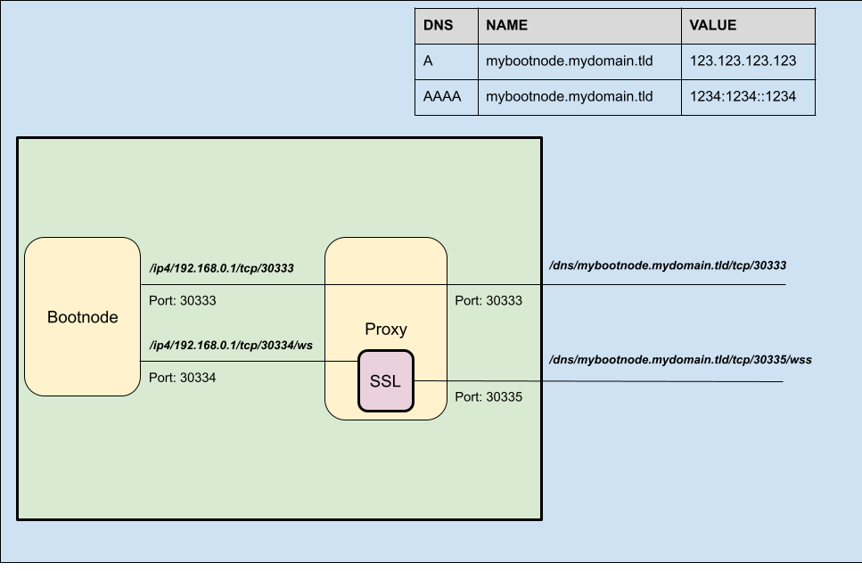

# Bootnodes

A bootnode is a regular network node that is made available to new nodes to help them discover the rest of the nodes of the network.

The details about the public bootnodes of a network are often hard-coded or embedded in the chain specification file and/or its executable binary, however, bootnodes can also be made available separately and added to the binary at time of execution.

To provide bootnode services under the Infrastructure Builders' Program, you will need to cater for the following two use cases:

1. Bootstrapping of new nodes starting connection to the network. For these nodes it would be enough to open the peer-to-peer port (default 30333) port to the public, either directly or through a proxy service to protect the bootnode.
2. Starting up light-clients, e.g. `smoldot`. For these nodes you would need to add an SSL certificate to the p2p protocol. This is done first by exposing an unsecure Websocket of the p2p network to the proxy, and allow the proxy to add the SSL certificate and expose it securely to the Internet.

This requirement is illustrated in the diagram below:



Let's see how this is done in your machine:

## Configure Bootnode Service

The `systemd` service file needs to include all the configuration for the ports in the diagram above, as well as provide public advertisement of the addresses where the services will be available, this is done by specifying the following:

```shell
# Edit the systemd service file to add listening ports and protocols
sudo nano /etc/systemd/system/polkadot1.service
```

and enter the following sample content for a Polkadot bootnode

```systemd title="/etc/systemd/system/polkadot1.service"
[Unit]
Description=Polkadot Bootnode
After=network-online.target
Wants=network-online.target

[Service]
User=polkadot
Group=polkadot
ExecStart=/usr/local/bin/polkadot \
  --name MY_BOOTNODE_01 \
  --chain polkadot \
  --base-path '/var/lib/polkadot/polkadot1' \
  --state-pruning 256 \
  --sync warp \
  --listen-addr /ip6/::/tcp/30333 \
  --listen-addr /ip6/::/tcp/30334/ws \
  --listen-addr /ip4/0.0.0.0/tcp/30333 \
  --listen-addr /ip4/0.0.0.0/tcp/30334/ws \
  --public-addr /dns/mybootnode.mydomain.tld/tcp/30333 \
  --public-addr /dns/mybootnode.mydomain.tld/tcp/30335/wss \
  --wasm-execution Compiled \
  --execution native-else-wasm \
  --no-hardware-benchmarks \
  --ws-external \
  --rpc-external \
  --rpc-methods safe \
  --rpc-cors all \
  --allow-private-ipv4

Restart=always
RestartSec=120

[Install]
WantedBy=multi-user.target
```

Please note that this service file makes use of the following flags:

- `--state-pruning`: a typical value of *`256`* or less is possible for a bootnode, please note that using a value less than 256 does not imply savings of storage space.
- `--sync`: the use of *`warp`* mode is supported for bootnodes, make use of it and speed up the syncing time!
- `--listen-addr`: to open the relevant p2p ports in the node, here we have created four instances: both IPv4 & IPv6 and both vanilla p2p & Websocket p2p.
- `--public-addr`: these are the addresses that the node will advertise to the network, note that they are not indicated in terms of IPv6 or IPv4 but in DNS addresses instead, and that although the port is a match for the vanilla p2p service, it is different for the internal websocket (ending in *`/ws`*) that is advertised as secured in another port (ending in *`/wss`*).
- `--ws-external`, `--rpc-external`, and `--rpc-methods safe` are used to restrict the type of commands made available in the **rpc** and **ws** ports
- The rest of the flags are there for convenience and performance.

## Configure HAProxy Service

If not already installed, please follow the following commands to install the latest version of HAProxy

```shell
# Install dependencies
sudo apt install software-properties-common

# Add the repository of the haproxy project
sudo add-apt-repository ppa:vbernat/haproxy-2.7

# Update the database of available packages
sudo apt update

# install haproxy
sudo apt install haproxy

# verify the installation
sudo haproxy -v
```

If HAProxy was correctly installed, the output will be similar to this one:

```text
HAProxy version 2.7.0-1ppa1~focal 2021/11/26 - https://haproxy.org/
Status: stable branch - will stop receiving fixes around Q3 2023.
Known bugs: http://www.haproxy.org/bugs/bugs-2.7.0.html
Running on: Linux 5.4.0-91-generic #102-Ubuntu SMP Fri Nov 5 16:31:28 UTC 2023 x86_64
```

By default, HAProxy is not configured to listen on any ports. In this step, since we are going to configure it as a reverse proxy, we are going to make changes to the default HAProxy configuration.

```shell
# Make a copy of the current configuration for backup
sudo cp -a /etc/haproxy/haproxy.cfg{,.bak}

# Edit the configuration file
sudo nano /etc/haproxy/haproxy.cfg
```

Add the following content to this file:

```conf title="/etc/haproxy/haproxy.cfg"
global
   log 192.168.0.1 local2
   chroot /var/lib/haproxy
   pidfile /var/run/haproxy.pid
   maxconn 250000
   user  haproxy
   group haproxy
   daemon
   nbthread 8
   tune.bufsize 131072
   tune.ssl.default-dh-param 4096
   stats socket /var/run/haproxy.sock mode 600 level admin
   stats timeout 2m
   maxcompcpuusage 50

defaults
   log global
   option httplog
   retries 3
   maxconn 250000
   timeout connect 5s
   timeout client 300s
   timeout server 300s

frontend frontend
   bind *:30334 ssl crt /etc/pki/my_ssl_certificate.pem
   mode http
   default_backend backend

backend backend
   mode http
   server local 192.168.0.1:30335 check inter 2s
```

## Restart the services

Finally, let's restart the services

```shell
# Restart the reverse proxy service
sudo systemctl restart haproxy

# Clear any previous blockchain database, if needed
sudo rm -r /var/lib/polkadot/*

# Restart the bootnode service
sudo systemctl restart polkadot1

# Recover the networkID of the bootnode
sudo journalctl -n 1000 -u polkadot1 | grep "Local node identity"
```

You will obtain a result like the one below, take note of the code, which is the `networkid` of your bootnode

```test
2023-05-25 23:14:13 🏷  Local node identity is: 12D3KooWK4Esdsg3xxC4RfrDVgcZzExg8Q3Q2G7ABUUitks1w
```

## Test your Bootnode

In order to test your bootnode, you will need the `networkid` recovered in the previous title.

Now you will need access to another machine, and right there on your home directory you can try:

```shell
# download the polkadot binary
sudo wget https://github.com/paritytech/polkadot-sdk/releases/download/v1.4.0/polkadot

# make it executable
sudo chmod 755 polkadot

# test the bootnode with plain p2p connection 
sudo ./polkadot --chain polkadot --reserved-only --reserved-nodes "/dns/mybootnode.mydomain.tld/tcp/30333/p2p/12D3KooWK4Esdsg3xxC4RfrDVgcZzExg8Q3Q2G7ABUUitks1w"

# test the bootnode with secured websocket over p2p connection
sudo ./polkadot --chain polkadot --reserved-only --reserved-nodes "/dns/mybootnode.mydomain.tld/tcp/30335/wss/p2p/12D3KooWK4Esdsg3xxC4RfrDVgcZzExg8Q3Q2G7ABUUitks1w"
```

In case that everything went well, after a while you will start to see, for each of the tests above, the following entries in the terminal:

```text
(...)
2023-05-25 23:14:18 ⚙️  Syncing, target=#15683014 (1 peers), best: #73951 (0x7d47…6f48), finalized #73728 (0x1b64…d0cc), ⬇ 217.1kiB/s ⬆ 2.7kiB/s
2023-05-25 23:14:23 ⚙️  Syncing 661.4 bps, target=#15683014 (1 peers), best: #77258 (0x009e…7ba1), finalized #76800 (0xf7b5…4250), ⬇ 279.6kiB/s ⬆ 2.6kiB/s
2023-05-25 23:14:28 ⚙️  Syncing 625.2 bps, target=#15683014 (1 peers), best: #80384 (0x17bc…2412), finalized #79872 (0x3fbb…48c7), ⬇ 261.3kiB/s ⬆ 2.4kiB/s
2023-05-25 23:14:33 ⚙️  Syncing 670.0 bps, target=#15683014 (1 peers), best: #83734 (0x959e…93fc), finalized #83456 (0x0f77…3c1e), ⬇ 257.3kiB/s ⬆ 2.4kiB/s
2023-05-25 23:14:38 ⚙️  Syncing 661.2 bps, target=#15683014 (1 peers), best: #87040 (0xd554…48c6), finalized #86528 (0xaba5…b67a), ⬇ 234.5kiB/s ⬆ 2.2kiB/s
2023-05-25 23:14:43 ⚙️  Syncing 659.0 bps, target=#15683014 (1 peers), best: #90335 (0x49b2…72f5), finalized #90112 (0x207a…cad6), ⬇ 229.7kiB/s ⬆ 2.1kiB/s
(...)
```

The new node is syncing, there is one (01) peer connected, and the `finalized block` is increasing, the bootnode connection was successful! :tada:

:::info
This method, although effective, is under revision due to its deviation from a pure bootnode's perspective (note that the new node connects to the bootnode and start syncing the chain against that bootnode, but it really does not allow to discover more nodes).
:::

## Back up your network key

You can already note that the `networkid` code is very important, because this is an unique code that identifies the bootnode in the network, should you ever need to recover your services (because anything happens to the bootnode itself or to the machine hosting it), the new bootnode will obtain a new random `networkid` and every user in the network will receive a message of the broken link:

```text
May 15 10:36:46 dot-boot polkadot[5596]: 2023-05-15 10:36:46 💔 The bootnode you want to connect to at `/ip4/185.127.231.68/tcp/30333/ws/p2p/12D3KooWKvdDyRKqUfSAaUCbYiLwKY8uK3wDWpCuy2FiDLbkPTDJ` provided a different peer ID `12D3KooWFHkJaz1BxqdAjzeLK4xcubxXP25kTaYWZqsJukuex5Ly` than the one you expect `12D3KooWKvdDyRKqUfSAaUCbYiLwKY8uK3wDWpCuy2FiDLbkPTDJ`.
```

And this would require you to create a new Pull Request to the project's Github repository to amend this problem. This is a lengthy process and you will potentially be responsible for flooding the journals with your error and it will be negative not only for your image, but for the reputation of the whole collective, thus please back up your network key as soon as you spin a new bootnode:

```shell title="In the bootnode machine"
# Copy the network keys to your home directory
sudo cp /var/lib/polkadot/polkadot1/chains/polkadot/network/secret_ed25519 ~

# Change owner to your SSH user
sudo chown myself:myself ~/secret_ed25519
```

Now from your local PC:

```shell title="In your local PC"
# Transfer the file securely to local
scp myself@mybootnode.mydomain.tld:~/secret_ed25519 .
```

And store it safely!

## Submit a Pull Request

Now you are ready to include your bootnode in the chain specification of the networks!...

To do that, go to the relevant Github repository (e.g. Polkadot) and identify the correct file containing the chain specifications.

:::tip
For Polkadot, the specification files are all at https://github.com/paritytech/polkadot/tree/master/node/service/chain-specs
:::

Fork the repository, add your bootnodes and create a Pull Request (PR) for the consideration of the relevant project team.

That is it... Your are now a Bootnode provider!
