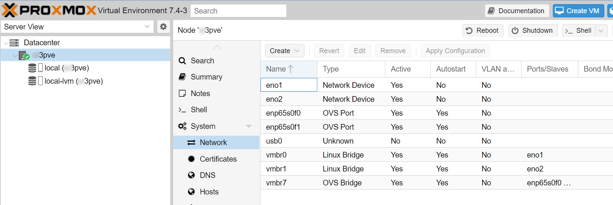
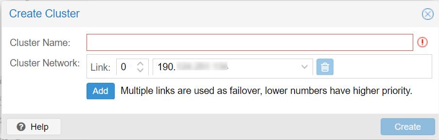
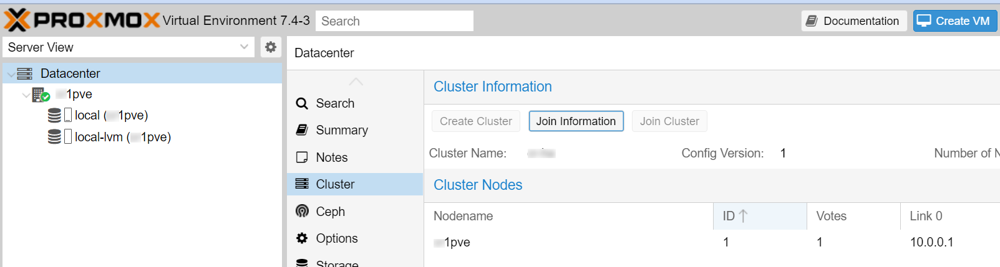
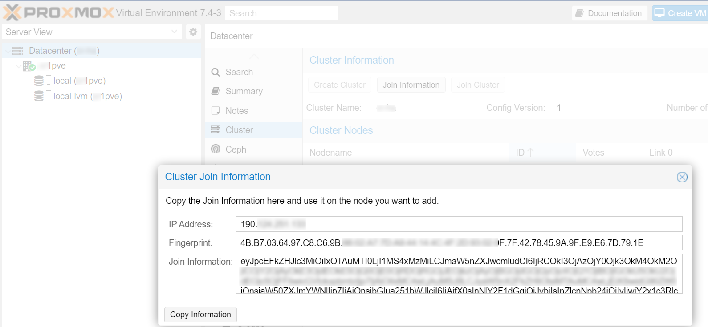
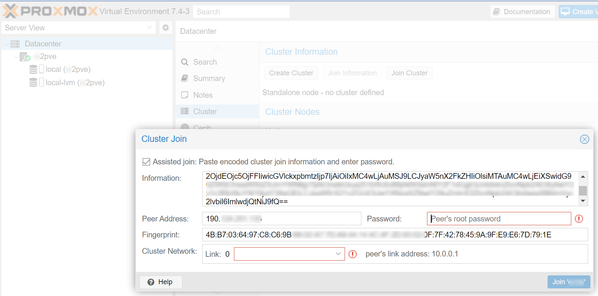

# Proxmox & Ceph

Proxmox offers certain level of ease when wanting to deploy a High Availability (HA) cluster of servers, using a high availability storage solution using Ceph.

:::note

This section assumes the creation of a HA cluster from freshly created Proxmox servers, if you are planning to migrate a server that is already in use to this cluster configuration, take into consideration that Proxmox does not readily allow joining when the server contains active VMs or containers.

:::

Firstly, you need at least to allocate three (3x) Proxmox servers already provisioned to follow the instructions of this wiki, if you want some guidance to deploy these, please refer to the relevant section here.

After that, you need to think about the appropriate network configuration to allow the HA cluster to perform at it best. You need the fastest available solution to interconnect the servers in your cluster. This is not always achievable using a standard network switch, thus for cluster with 4 or less nodes, we propose you to deploy a ring network as outlines [here](/docs/6-members/3-networking/1-ringnetwork-proxmox.md).

After setting up your dedicated high-speed network, make sure that the relevant interfaces are up:

```shell
ip -br a
```

which should show something like:

```
lo               UNKNOWN        127.0.0.1/8 ::1/128
eno1             UP
eno2             UP
enp65s0f0        UP             fe80::b696:900f:feb3:b0ea/64
enp65s0f1        UP             fe80::b696:900f:feb3:b0eb/64
usb0             DOWN
ovs-system       DOWN
vmbr7            UNKNOWN        10.0.0.1/29 fe80::f47d:9aff:fec8:6c48/64
vmbr0            UP             150.114.151.103/32 fe80::3eec:efff:fece:d050/64
vmbr1            UP             fe80::3eec:efff:fece:d051/64
```

You can also check this in the graphical interface of your hypervisor, e.g. in Proxmox:



and to reconfirm, try to ping the other servers:

```
ping 10.0.0.2
```

The following procedures have been derived from two videos made available at:

1. [Instalar Proxmox Crear Cluster + CEPH + HA Parte 1](https://youtu.be/kPyZ-uzwMag)
2. [Instalar Proxmox Crear Cluster + CEPH + HA Parte 2](https://youtu.be/JUye9q2GfXs)

## Proxmox HA cluster













## Proxmox Ceph SDS


