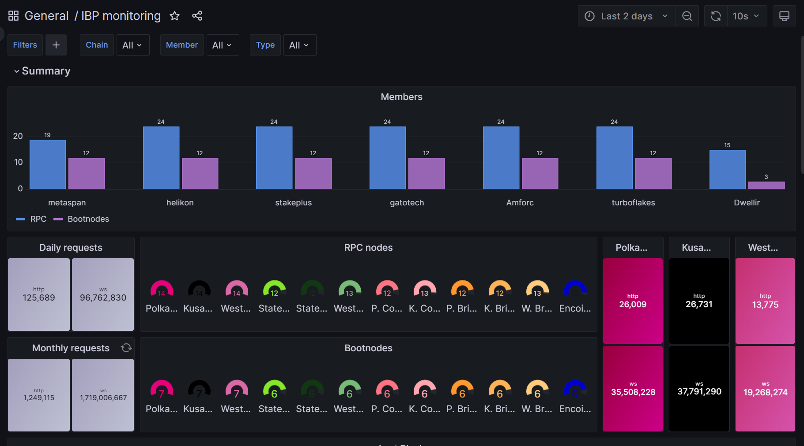
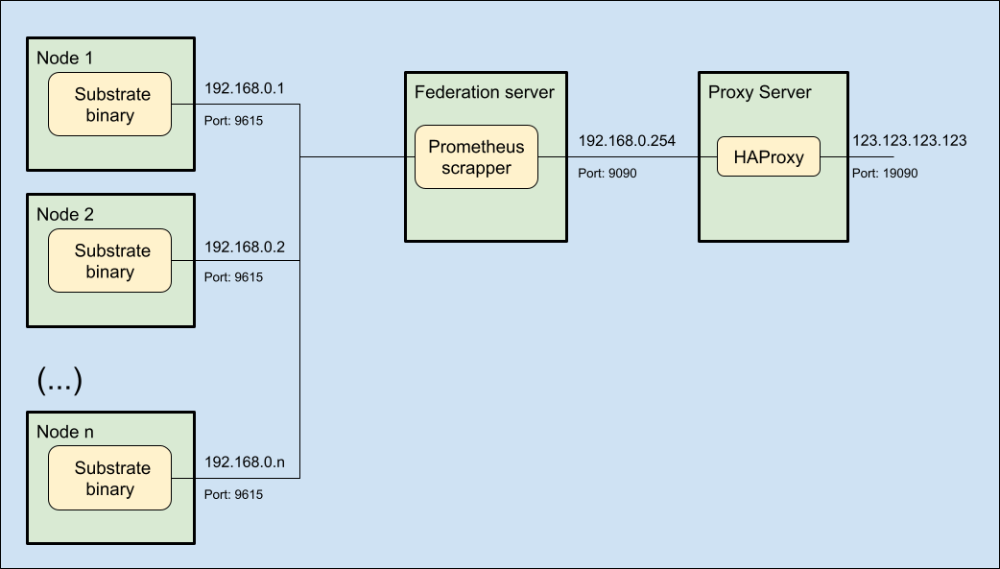
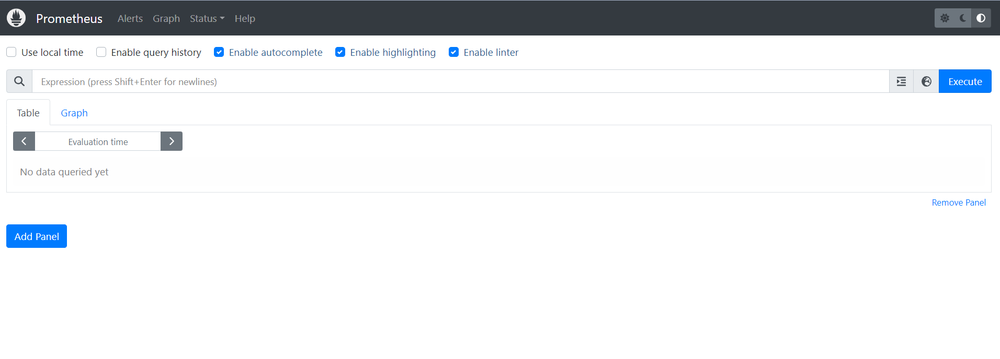
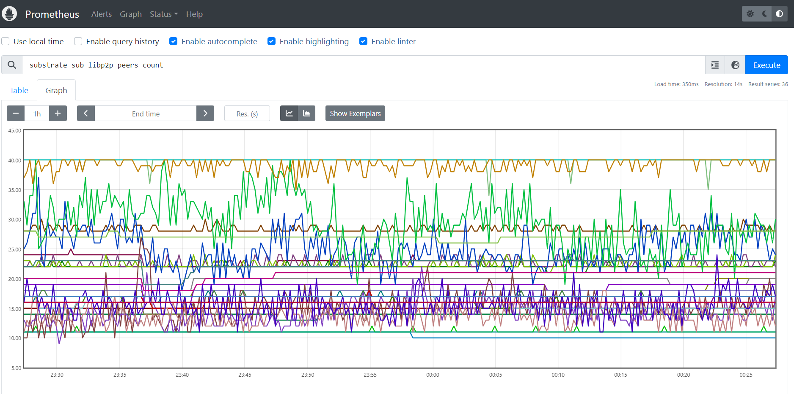

# Grafana

The members of the professional path of the programme agree to submit metrics of all their nodes to a centralized Grafana's private dashboard for reporting and digests.

This dashboard looks like this:



## Prometheus

The metrics fed by the members are scrapped from each of the individual nodes by means of the integrated Prometheus instance built-in in the polkadot, cumulus and other substrate-based binaries.

All the metrics from those individual Prometheus instances can be aggregated through a concept called [Federation](https://prometheus.io/docs/prometheus/latest/federation/), and the most prominent benefit of this concept in the context of IBP is to keep the nodes fairly secured behind the federation and a proxy server.



## Prerequisites

In order to consolidate the metrics in your federation server, you will first need to allow the individual nodes to run their Prometheus instances and open the relevant ports to communicate with the federation server:

In each node, confirm that the binary is configured to run and expose Prometheus metrics:

```shell
# This is an example for a polkadot node
sudo nano /etc/systemd/system/polkadot1.service
```

```systemd title="/etc/systemd/system/polkadot1.service"
(...)
ExecStart=/usr/local/bin/polkadot \
(...)
    --prometheus-external \
(...)
```

:::info
Prometheus is exposed by default in port **9615**, but a custom port can also be specified using the flag `--prometheus-port <PORT>` option.
:::

Additionally, please make sure that the port is opened to the federation node:

```shell
# This is an example for a Prometheus standard port
sudo ufw allow in 9615/tcp

# Then check the new rule was successfully created
sudo ufw status verbose
```

and it should result in something similar to:

```text
Status: active
Logging: on (low)
Default: deny (incoming), allow (outgoing), disabled (routed)
New profiles: skip

To                         Action      From
--                         ------      ----
22/tcp                     ALLOW IN    Anywhere                   # SSH port
30333/tcp                  ALLOW IN    Anywhere                   # P2P port
9615/tcp                   ALLOW IN    Anywhere                   # Prometheus port
30333/tcp (v6)             ALLOW IN    Anywhere (v6)              # P2P port
```

## Federation server

Now it is time that you provision a small Virtual Machine (VM) inside your environment to host the Prometheus federation instance.

Your have the option to follow the instructions in the IBP's [github repository](https://github.com/ibp-network/member-prometheus) or to proceed manually as explained in this documentation.

1. Provision a virtual machine.
2. (optional) Create a separate user for Prometheus.
3. Download and install the Prometheus files.
4. Configure and run the Prometheus service.
5. (optional) Open the firewall ports.

### Virtual Machine

Please provide a VM with the following minimum requirements:

- 1 CPU core.
- 1 GHz.
- 1 GB RAM.
- 16 GB storage.
- Ubuntu Server 22.04 LTS.

:::info
For the purposes of this wiki, we are sticking to the Proxmox - Ubuntu stack, thus the minimum requirements may diverge from what you can see in the repository indicated above.
:::

### Create User

This step is optional but recommended. For testing purposes you can just use your own user, or the `root` one.

Create a system user called `prometheus` and its corresponding group but without password, without home directory and without login shell:

```shell
# Create a secured system user and its group
sudo adduser \
   --system \
   --group \
   --no-create-home \
   --disabled-password \
   --shell /usr/sbin/nologin \
   prometheus
```

### Install Prometheus

:::info
Check the [starting page](https://prometheus.io/docs/prometheus/latest/getting_started/) of the Prometheus project to get the latest installation instructions
:::

Let's start by preparing the machine:

```shell
# Update the aptitude database and make the relevant upgrades
sudo apt update
sudo apt full-upgrade

# create a temporary directory where to download and unpack the compressed files
sudo mkdir /tmp/prometheus
cd /tmp/prometheus
sudo wget https://github.com/prometheus/prometheus/releases/download/v2.45.0/prometheus-2.45.0.linux-amd64.tar.gz
sudo tar /tmp/prometheus/prometheus-*.linux-amd64.tar.gz
```

:::info
Check the [download page](https://prometheus.io/download/) of the Prometheus project for the latest binary version
:::

Then distribute the contents in the appropriate folders according to their function (binaries, configuration, data):

```shell
# Move the binaries to the relevant directory
cp /tmp/prometheus/prometheus*.linux-amd64/prometheus /usr/local/bin/
cp /tmp/prometheus/prometheus*.linux-amd64/promtool /usr/local/bin/

# Create a configuration directory and move recursively all files to there
mkdir /etc/prometheus
cp -r /tmp/prometheus/prometheus*.linux-amd64/consoles /etc/prometheus
cp -r /tmp/prometheus/prometheus*.linux-amd64/console_libraries /etc/prometheus

# Create a directory to keep the local Prometheus data
mkdir /var/lib/prometheus

# Update the permission modes for the executable files
chmod 755 /usr/local/bin/prometheus
chmod 755 /usr/local/bin/promtool

# Update the owner of all relevant files and directories
chown prometheus:prometheus /usr/local/bin/prometheus
chown prometheus:prometheus /usr/local/bin/promtool
chown prometheus:prometheus /var/lib/prometheus/ -R
chown prometheus:prometheus /etc/prometheus/ -R

# Optionally, remove the temporal files (otherwise these will be removed automatically next reboot)
cd ..
rm -rf /tmp/prometheus*
```

Let us now configure the service

### Configure Prometheus

Prometheus uses two main types of configuration files, a `rules.yml` that will declare the alert conditions of the instance, and a `prometheus.yml` that will contain the main configuration for the service.

Let's create first a file with the a single and very basic alert rule:

```shell
# Create or edit the alert rules' file
sudo nano /etc/prometheus/rules.yml
```

```yaml title="/etc/prometheus/rules.yml"
groups:
  - name: alert_rules
    rules:
      - alert: InstanceDown
        expr: up == 0
        for: 5m
        labels:
          severity: critical
        annotations:
          summary: "Instance $labels.instance down"
          description: "[{{ $labels.instance }}] of job [{{ $labels.job }}] has been down for more than 1 minute."

```

We should be able to test if the rule was correctly defined with the help of the `promtool` program that is shipped with Prometheus:

```shell
# Check rules.yml for errors
sudo promtool check rules /etc/prometheus/rules.yml
```

And it should result in a clean output like below:

```text
Checking /etc/prometheus/rules.yml
  SUCCESS: 1 rule found
```

Now we proceed to create the main configuration file.

Please note that you should replace the values `membername` and all IP addresses and ports (e.g. `192.168.0.1:9615`) to match your own infrastructure details:

```shell
# Create or edit the Prometheus configuration file
sudo nano /etc/prometheus/prometheus.yml
```

```yaml title="/etc/prometheus/prometheus.yml"
global:
  scrape_interval: 15s
  evaluation_interval: 15s
  external_labels:
    ibp_member: membername
    member: membername

rule_files:
  - rules.yml

scrape_configs:
  - job_name: prometheus
    metrics_path: /metrics
    static_configs:
    - targets:
      - 127.0.0.1:9090
  - job_name: substrate
    metrics_path: /metrics
    static_configs:
    - targets:
      - 192.168.0.1:9615
      - 192.168.0.2:9615
        # (...)
      - 192.168.0.15:9615
      labels:
        node_type: rpc
    - targets:
      - 192.168.0.32:9615
      - 192.168.0.33:9615
        # (...)
      - 192.168.0.63:9615
      labels:
        node_type: boot

    metric_relabel_configs:
      - action: replace
        source_labels:
        - chain
        target_label: chain
        regex: westend2
        replacement: westend
      - action: replace
        source_labels:
        - chain
        target_label: chain
        regex: ksmcc3
        replacement: kusama
      - action: replace
        source_labels:
        - chain
        target_label: chain
        regex: collectives_polkadot
        replacement: collectives-polkadot
      - action: replace
        source_labels:
        - chain
        target_label: chain
        regex: collectives_westend
        replacement: collectives-westend
      - action: replace
        source_labels:
        - chain
        target_label: chain
        regex: encointer-kusama
        replacement: encointer
```

Again, we can use the companion tool to check that there are no errors in the file:

```shell
# Check prometheus.yml file for errors 
sudo promtool check config /etc/prometheus/prometheus.yml
```

A successful test should look like this:

```text
Checking /etc/prometheus/prometheus.yml
  SUCCESS: 1 rule files found
 SUCCESS: /etc/prometheus/prometheus.yml is valid prometheus config file syntax

Checking /etc/prometheus/rules.yml
  SUCCESS: 1 rule found
```

Finally, let us prepare the systemd service file for Prometheus to run in the node:

```shell
# Create or edit the Prometheus service file
sudo nano /etc/systemd/system/prometheus.service
```

```systemd title="/etc/systemd/system/prometheus.service"
[Unit]
  Description=Prometheus Monitoring
  Wants=network-online.target
  After=network-online.target

[Service]
  User=prometheus
  Group=prometheus
  Type=simple
  ExecReload=/bin/kill -HUP $MAINPID
  ExecStart=/usr/local/bin/prometheus \
  --config.file /etc/prometheus/prometheus.yml \
  --storage.tsdb.path /var/lib/prometheus/ \
  --web.console.templates=/etc/prometheus/consoles \
  --web.console.libraries=/etc/prometheus/console_libraries \
  --web.listen-address=0.0.0.0:9090

[Install]
  WantedBy=multi-user.target
```

And start the service with the following final commands:

```shell
sudo systemctl start prometheus
sudo systemctl enable prometheus
```

A quick test can be performed to ascertain that the Prometheus service is working as expected.

This can be done with the following command:

```shell
# Test the Prometheus endpoint in the localhost
sudo curl localhost:9090/metrics
```

It should provide a long list of metrics like the one below:

```text
# HELP go_gc_duration_seconds A summary of the pause duration of garbage collection cycles.
# TYPE go_gc_duration_seconds summary
go_gc_duration_seconds{quantile="0"} 2.9579e-05
go_gc_duration_seconds{quantile="0.25"} 3.3953e-05
go_gc_duration_seconds{quantile="0.5"} 4.5271e-05
go_gc_duration_seconds{quantile="0.75"} 5.7063e-05
go_gc_duration_seconds{quantile="1"} 0.000107134
go_gc_duration_seconds_sum 1.902502448
go_gc_duration_seconds_count 36940
# HELP go_goroutines Number of goroutines that currently exist.
# TYPE go_goroutines gauge
go_goroutines 141
# HELP go_info Information about the Go environment.
# TYPE go_info gauge
go_info{version="go1.20.5"} 1
# HELP go_memstats_alloc_bytes Number of bytes allocated and still in use.
# TYPE go_memstats_alloc_bytes gauge
go_memstats_alloc_bytes 1.16491768e+08
# HELP go_memstats_alloc_bytes_total Total number of bytes allocated, even if freed.
# TYPE go_memstats_alloc_bytes_total counter
go_memstats_alloc_bytes_total 2.970948152712e+12
# (...)
```

### Update Firewall

This is an optional but certainly recommended step for this deployment within the IBP.

The Prometheus port configured in the last step should be open to the exterior of the federation node and at least allow connections from the HAProxy server that will be configured in the next step.

If you are using Uncomplicated Firewall (UFW) then this procedure only takes one command:

```shell
# Open the Prometheus port
sudo ufw allow in 9090/tcp

# Check the current status of the firewall
sudo ufw status verbose
```

and if everything went well, you should receive the following output:

```text
Status: active
Logging: on (low)
Default: deny (incoming), allow (outgoing), disabled (routed)
New profiles: skip

To                         Action      From
--                         ------      ----
22/tcp                     ALLOW IN    Anywhere                   # SSH Port
9090/tcp                   ALLOW IN    Anywhere                   # Prometheus Port
```

As an additional test that the firewall rule is working, log into another host of the same subnet (e.g. 192.168.0.251) and try the following command:

```shell
# Test the Prometheus endpoint in the private subnet
sudo curl 192.168.0.254:9090/metrics
```

If the relevant metrics show, then you can proceed to publish them as follows:

## HAProxy Configuration

In order to make the federation metrics available to the Internet, you will need to add this Prometheus node as a backend of your HAProxy deployment and publish this service in a specific port of your public IP address.

So, head to your HAProxy node and add these details to the `/etc/haproxy/haproxy.cfg` configuration file:

```conf title="/etc/haproxy/haproxy.cfg"
# (...)

frontend prometheus-frontend
   bind *:19090
   mode tcp
   use_backend prometheus-backend

# (...)

backend prometheus-backend
   mode tcp
   server 192.168.0.254:9090 check inter 2s

# (...)
```

Then restart the service to update the proxy to the latest configuration.

```shell
# Restart the reverse proxy service
sudo systemctl restart haproxy
```

You can now try to run the usual test command against the public IP:port combination:

```shell
# Test the Prometheus endpoint in the public Internet
sudo curl 123.123.123.123:19090/metrics
```

It should result in a similar output as before, and the best news is that you can now navigate in your browser to the public IP:port combination (e.g. http://123.123.123.123:19090) to have a preview of the prometheus console.

The landing page should look similar to this:



By clicking on the globe icon at the left of the "Execute" button, you can browse all metrics available in the instance:


Just for fun, let's search for `substrate_sub_libp2p_peers_count` and select it, then click on "Execute" and select the "Graph" tab to see this lovely chart



Your Prometheus federation node is now up and running publicly

## Grafana service

Finally, please let the IBP team know that your federation metrics are available by submitting a Pull Request (PR) to the [`prometheus_ansible`](https://github.com/ibp-network/prometheus-ansible) Github repository.

For that, you need to fork the repository and edit the [`prometheus.yml`](https://github.com/ibp-network/prometheus-ansible/blob/main/roles/prometheus/files/prometheus.yml) file to add the details of your federation metrics as follows:

```yaml title="prometheus-ansible/roles/prometheus/files/prometheus.yml"
#(...)
- job_name: "membername"
    scrape_interval: 15s
    honor_labels: true
    metrics_path: "/federate"
    params:
      "match[]":
        - '{job="substrate"}'
    static_configs:
      - targets:
          - "123.123.123.123:19090"
#(...)
```

After committing this change in your forked repository, convert it to a Pull Request to the original repository.

Wait for the PR to be merged and deployed, then navigate to https://ibp-monitor.bldnodes.org/ to verify that your metrics are now showing in the dashboard.

.-
